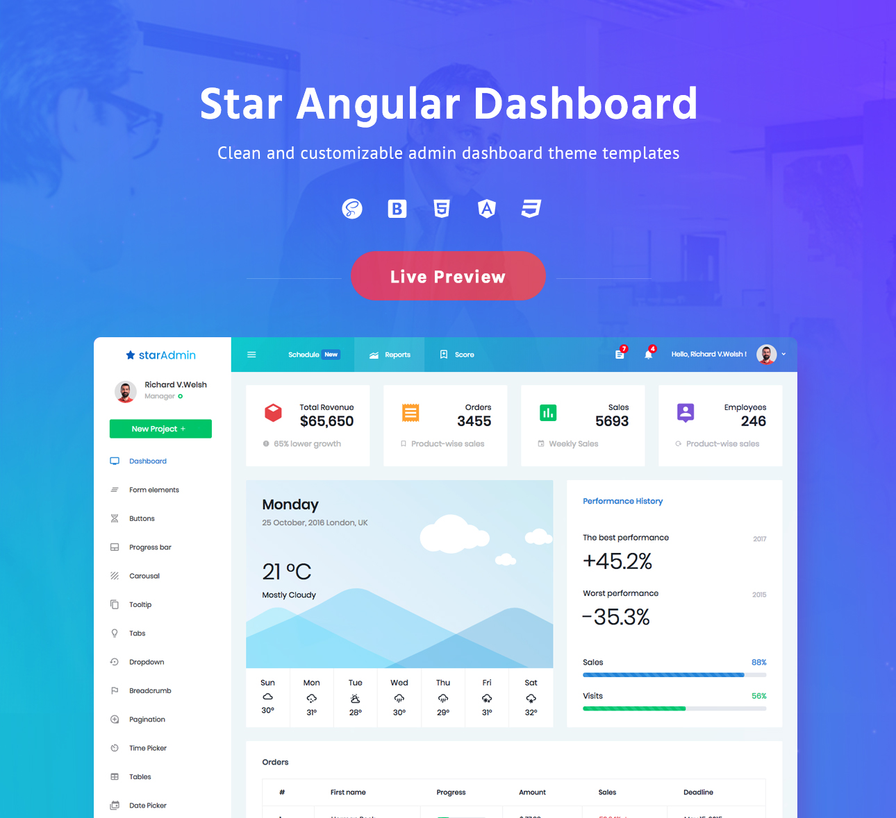

# StarAdmin Free Angular Admin Template


StarAdmin Free Angular Admin Template is a free admin template based on Bootstrap 4. The template is built using the framework NG-Bootstrap.

StarAdmin Free Angular Admin Template is a completely responsive and mobile-first admin template that provides a great foundation for your Angular + Bootstrap project.
This remarkably flexible and highly customizable template helps you create an amazing UI for your admin panel.

## Demo

Visit: https://www.bootstrapdash.com/demo/star-admin-angular/

[](http://www.bootstrapdash.com/demo/star-admin-angular)

## Installation

### What's included

Within the download you'll find the following directories and files, logically grouping common assets and providing both compiled and minified variations. You'll see something like this:

```
StarAdmin Free Angular Admin Template/
├── dist/
├── e2e/
├── src/
├── .editorconfig
├── .gitignore
├── angular.json
├── package-lock.json
├── package.json
├── README.md
├── screenshot.jpg
├── tsconfig.json
├── tslint.json
```
